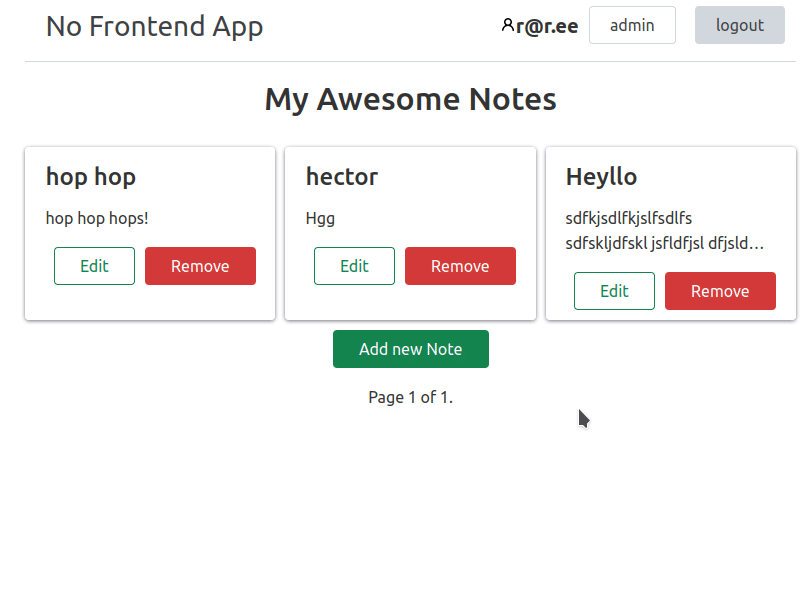

# No Frontend App

> Well, **not really**, but the main idea that there was not written a single line of JS to make app feel like it is a modern site that works without page reloading.
> ***
> Example Application
> 

## Technology

1. UP for making site interactive https://unpoly.com
2. Chota for minimal CSS styling https://jenil.github.io/chota/
3. Django as a server

## Why?

I am curious how viable is this idea to render html and replace parts of the layout on the fly as opposite to traditional SPA model. First I heard about this idea from this podcast episode https://player.fm/series/series-1401837/ep-151-dhh-building-hey-with-hotwire where Adam Wathan talks with DHH.

I was checking django-hotwire group on github https://github.com/hotwire-django as a community effort to port the library to Django world. But at that time all the projects were in too early stages and to be honest the approaches with new view-like classes did not make sense to me. 

On the next stage the new framework https://htmx.org appeared that have low-level API to make these layouts replacing happen. But luckily saw on Reddit that there is more mature tool called Unpoly. It does not have too much activity, but the ideas behind it and simplicity to implement is amazing. So here we are with example Django app and Unpoly "integration" (there was really nothing to integrate).

## How to run locally

The project is Dockerized, so I am expecting that Docker and docker-compose are installed on your machine.

1. `make setup`
2. `make migrate`
3. `make docker-manage cmd=createsuperuser`
4. `docker-compose up`
